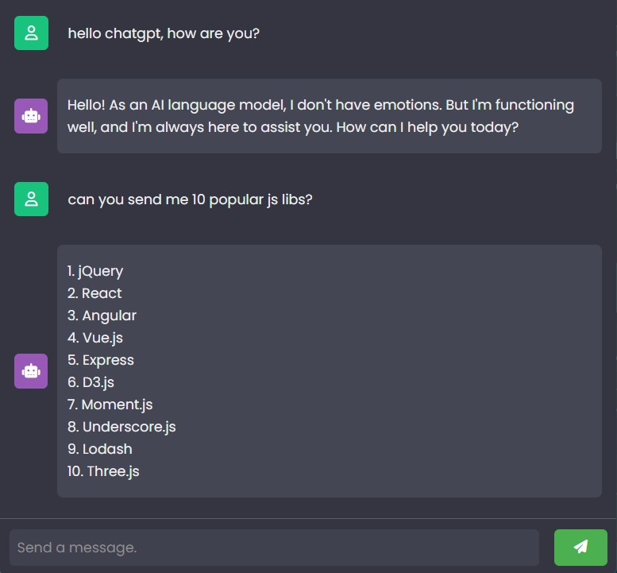

### ChatGPT Bot
Using chatgpt api to code a chatgpt bot with javascript. A project that you can ask anything from chatgpt with Javascript❗️
Also I use Rapidapi and official chatgpt api in this bot too.

## Warning
You need to get your own API key and replace the headers and URL section in index.js file and also if there is a model for a different API then modify the body section also in the code :

```javascript
'content-type': 'application/json',
'X-RapidAPI-Key': 'Your Key',
'X-RapidAPI-Host': 'chatgpt53.p.rapidapi.com'
```
```javascript
body: `{"model" = "model name", "messages":[{"role":"user","content":"${message}"}]}`
```

# Screenshot
Here is the project screenshot :


